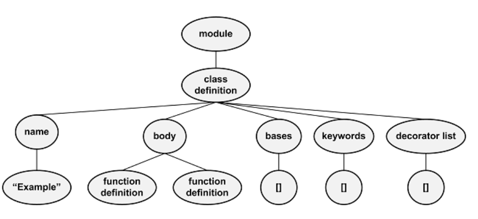

# Python ast-package
### 一、介绍
ast: 抽象语法树

### 二、基本功能
-`parse(code_str)` 从包含 Python 代码的字符串创建抽象语法树
-`dump(node, annotate_fields=True, include_attributes=False, *, indent=None)`: 将抽象语法树转换为字符串


**使用ast.parse()**
```
import ast

tree = ast.parse("for i in range(10):\n\tprint('Hi there!')")
print(ast.dump(tree, indent=4))
```

执行代码会生成如下结果：

```
Module(
    body=[
        For(
            target=Name(id='i', ctx=Store()),
            iter=Call(
                func=Name(id='range', ctx=Load()),
                args=[
                    Constant(value=10)],
                keywords=[]),
            body=[
                Expr(
                    value=Call(
                        func=Name(id='print', ctx=Load()),
                        args=[
                            Constant(value='Hi there!')],
                        keywords=[]))],
            orelse=[])],
    type_ignores=[])
```
### 三、抽象语法树 ast
每个语句节点都有一个或多个子节点，其子节点的数量和类型的变化取决于语句的类型。
**函数定义**
例如：一个函数定义至少有四个孩子：一个标识符、参数、一个装饰器列表和一组构成其主体的语句。
如下代码定义了一个function `foo()`
```
tree = ast.parse("def foo():\n\tprint('Hello!')")
print(ast.dump(tree, indent=4))
```
ast 语法树结构如下
根节点为一个模块，子结点是一个函数定义。函数定义有4个孩子：标识符、参数、装饰器列表、函数主体语句
```
Module(
    body=[
        FunctionDef(
            name='foo',
            args=arguments(
                posonlyargs=[],
                args=[],
                kwonlyargs=[],
                kw_defaults=[],
                defaults=[]),
            body=[
                Expr(
                    value=Call(
                        func=Name(id='print', ctx=Load()),
                        args=[
                            Constant(value='Hello!')],
                        keywords=[]))],
            decorator_list=[])],
    type_ignores=[])
```

**类的定义**
类定义尤为重要，每个子类都有五个子类：一个名称、零个或多个基类、零个或多个关键字、零个或多个语句以及零个或多个装饰器。类中的每个方法都由一个函数定义语句表示。
```
class Example:
    def __init__(self):
        self.prop = 4

    def printProp(self):
        print(self.prop)
```

利用`ast.parse()`进行代码解析获取AST
```
tree = ast.parse("class Example:\n\tdef __init__(self):\n\t\tself.prop = 
       4\n\n\tdef printProp(self):\n\t\tprint(self.prop)")
```
图示展示了class的顶级节点（而不是整个AST）


### 四、ast
Python AST 中的每个节点类型在 ast 包中都有一个对应的类。
1. 模块由Module类的实例表示
2. 表达式由Expr实例表示
3. 函数定义由FunctionDef实例表示
4. 类定义由ClassDef实例表示。

例如，以下代码列出了if语句的子项
`print(ast.IF.__fields)`
打印输出为 `('test', 'body', 'orelse')`

#### 4.1 ast.walk()
bfs 访问 tree 的节点

#### 4.2 ast.NodeVisitor()
dfs 访问 tree 的节点: walk the tree with recursion.

**上内容节选自：**
>https://www.ai8py.com/analyzing-python-with-the-ast-package.html
